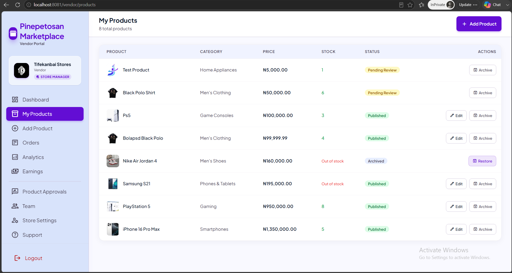
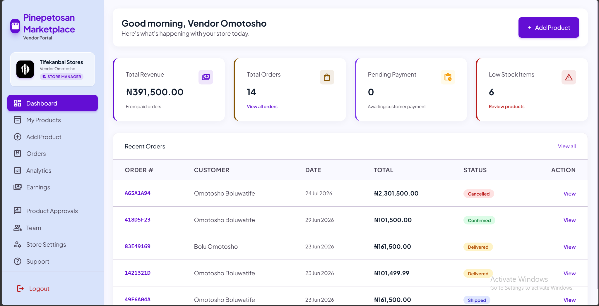

# Marketplace

A multi-vendor e-commerce marketplace built with Spring Boot 3.5 and Java 21. Independent vendors run their own storefronts with their own teams; customers browse, buy through Paystack, track delivery, and review verified purchases; admins oversee the whole platform.

Authentication runs through Keycloak over OIDC, with a four-tier role hierarchy and a vendor-side team structure managed through the Keycloak Admin API. Every push to `main` builds a container image and redeploys it.





---

## Stack

| Layer | Technology |
|---|---|
| Language | Java 21 |
| Framework | Spring Boot 3.5 (Web, Data JPA, Security, Validation) |
| Identity | Keycloak (OIDC authorization-code flow), Spring Security OAuth2 Client |
| Database | PostgreSQL, schema versioned with Flyway (21 migrations) |
| Views | Thymeleaf with `thymeleaf-extras-springsecurity6` |
| Payments | Paystack (NGN) |
| API docs | springdoc-openapi (Swagger UI) |
| Build | Maven, Lombok |
| Container | Jib (`eclipse-temurin:21-jre-jammy`, OCI format) |
| CI/CD | GitHub Actions → Docker Hub → Railway |

---

## Domain model

Fourteen UUID-keyed JPA entities.

**Identity and vendors**
- `User` — platform account, linked to its Keycloak subject via `keycloakId`. Role: `CUSTOMER`, `VENDOR`, `SUB_VENDOR`, `ADMIN`.
- `Vendor` — a selling company. Owns store profile, logo, website and bank details. One owner, many members.
- `VendorMember` — joins a `User` to a `Vendor` with a member role of `VENDOR_ADMIN` or `SUB_VENDOR`, plus who invited them.

**Catalog**
- `Category` — self-referential parent/child tree with ordering and an active flag.
- `Product` — belongs to a `Vendor` and a `Category`. Moves through `DRAFT` → `PENDING_REVIEW` → `PUBLISHED`, with `PENDING_EDIT`, `REJECTED` and `ARCHIVED` branches. Tracks stock, SKU, and denormalised `averageRating` / `reviewCount`.
- `ProductImage` — ordered images with a primary flag, cascaded from `Product`.

**Commerce**
- `CartItem` — unique per customer and product.
- `Order` — snapshots shipping name, phone and address onto the row so historical orders survive later profile edits. Statuses: `PENDING_PAYMENT`, `PAID`, `PROCESSING`, `SHIPPED`, `DELIVERED`, `CONFIRMED`, `CANCELLED`, `REFUNDED`. Holds the Paystack reference, channel and paid timestamp.
- `OrderItem` — snapshots product name, vendor name, unit price and line total, so an order stays readable if the product is later removed.
- `Review` — requires an `Order`, so every review is tied to a verified purchase.
- `WishlistItem`, `CustomerAddress` (max five per customer, one default).

**Platform**
- `PhoneOtpSession` — hashed OTP, expiry, and request/attempt counters for rate limiting.
- `PlatformSetting` — key/value store restricted to a whitelisted set of keys.

Notable migrations: `V19` introduced the vendor hierarchy, `V20` moved product ownership from the individual user to the `Vendor` entity, and `V21` cleaned up the now-unused vendor columns on `users`.

---

## Roles

Roles live in the Keycloak realm and are mapped to Spring `ROLE_*` authorities from the `realm_access` claim on login.

| Role | Capabilities |
|---|---|
| `CUSTOMER` | Browse and search the catalog, manage cart, checkout via Paystack, retry failed payments, cancel unpaid orders, confirm delivery, review delivered items, manage wishlist and up to five saved addresses. |
| `SUB_VENDOR` | Create and edit their own products and images, submit them for approval, fulfil orders containing their products, view their own analytics and earnings. |
| `VENDOR` | Everything a sub-vendor can do, plus approving or rejecting team submissions, inviting and revoking sub-vendors, editing the store profile, and viewing vendor-wide analytics across the whole team. |
| `ADMIN` | Inspect all users and vendors with per-record drill-in, take down published products, view and update any order, edit platform settings, and view platform-wide revenue and top-vendor reports. |

New accounts are provisioned on first login. A short-lived `nm_reg_mode` cookie set by `/register/customer` or `/register/vendor` survives the Keycloak round-trip and tells the success handler whether to create a `Vendor` and grant `ROLE_VENDOR`, or default to `ROLE_CUSTOMER`.

---

## Key flows

**Authentication.** Standard OIDC authorization-code flow against the `ecommerce` realm, callback at `/login/oauth2/code/keycloak`. A separate phone-based path (`/login/phone`) issues a hashed, rate-limited OTP through a pluggable SMS provider, with a logging implementation for local development.

**Checkout.** `POST /customer/checkout` creates an order in `PENDING_PAYMENT`, snapshots the line items and shipping details, initialises a Paystack transaction and redirects. Paystack returns to `/customer/checkout/callback`, where the transaction is verified server-side before the order flips to `PAID`. Failed payments can be retried with a fresh reference rather than rebuilding the cart.

**Product approval.** Vendor team members submit products for review. A `VENDOR_ADMIN` within the same company approves them to `PUBLISHED` or rejects them with a reason. Approval is internal to each vendor rather than centralised with platform admins.

**Team management.** Inviting a sub-vendor creates the user in Keycloak through the Admin API, assigns `ROLE_SUB_VENDOR`, and triggers an invitation email using the `UPDATE_PASSWORD` required action so the invitee sets a password and lands straight in the app.

**Fulfilment.** Vendors move orders through `PAID` → `PROCESSING` → `SHIPPED` → `DELIVERED`. The customer then confirms delivery, which moves the order to `CONFIRMED` and unlocks reviewing.

**Image upload.** `POST /vendor/images/upload` writes to disk with MIME type and size validation and path-traversal guards.

A mobile-web variant under `/mobile/**` mirrors the customer journey against the same services with phone-width templates.

---

## Running locally

**Prerequisites:** JDK 21, PostgreSQL, a Keycloak instance, and Paystack test keys.

```bash
git clone https://github.com/boluwatifeomotosho/ecommerce.git
cd ecommerce
```

Set the following environment variables (do not commit them):

```
SPRING_DATASOURCE_URL=jdbc:postgresql://localhost:5432/marketplace
SPRING_DATASOURCE_USERNAME=
SPRING_DATASOURCE_PASSWORD=

KEYCLOAK_ISSUER_URI=http://localhost:8081/realms/ecommerce
KEYCLOAK_CLIENT_ID=ecommerce-app
KEYCLOAK_CLIENT_SECRET=
KEYCLOAK_ADMIN_USERNAME=
KEYCLOAK_ADMIN_PASSWORD=

PAYSTACK_SECRET_KEY=
PAYSTACK_PUBLIC_KEY=

APP_BASE_URL=http://localhost:8080
```

Then:

```bash
./mvnw clean package
./mvnw spring-boot:run
```

Flyway applies all migrations on first boot. The app serves on `http://localhost:8080`, with API documentation at `/swagger-ui.html`.

**Keycloak setup.** Create a realm named `ecommerce` and a confidential client `ecommerce-app` with the authorization-code grant, scopes `openid profile email`, and redirect URI `{APP_BASE_URL}/login/oauth2/code/keycloak`. Create realm roles `ROLE_CUSTOMER`, `ROLE_VENDOR`, `ROLE_SUB_VENDOR` and `ROLE_ADMIN`. The custom login theme lives under `keycloak/themes/ecommerce/` and must be mounted into the Keycloak server's themes directory, then selected in the realm's login theme setting.

> The realm configuration is not versioned in this repository. Exporting it to `keycloak/realm-export.json` is on the roadmap below.

---

## CI/CD

`.github/workflows/action.yml` runs on every push to `main`:

1. **build** — provisions JDK 21 on Ubuntu.
2. **build-image** — runs `mvn clean package jib:build` and pushes an OCI image to Docker Hub.
3. **deploy** — points the Railway service at the new image tag, which triggers a redeploy.

---

## Known limitations

Stated plainly, because scope honesty is more useful than a feature list.

- **Test coverage is minimal.** Only the generated `contextLoads()` smoke test exists. Service, controller, security and payment-callback tests are the top priority.
- **Commission is not applied.** `commission.rate` is stored as a platform setting but nothing reads it. Vendor earnings shown are gross.
- **Delivery fee is a flat constant** rather than zone- or weight-based.
- **Search is category, sort and name-prefix only.** No full-text search.
- **Refunds are unreachable.** `REFUNDED` exists in the order status enum but no flow transitions into it.
- **No transactional email from the app.** Keycloak sends invitations and password resets; order confirmations and shipping updates are not sent.
- **`DELIVERY_AGENT` and `WAREHOUSE_OFFICER`** appear in the security configuration but have no controllers or templates behind them.
- **No admin-side vendor suspension or approval.** Vendors self-publish through their own internal approval step.
- **No carrier integration.** Shipping is an order status, not a logistics integration.

## Roadmap

1. Test suite: service unit tests, controller slice tests, and integration coverage of the Paystack callback and role-based access rules.
2. Version the Keycloak realm as an importable JSON export.
3. Apply the configured commission rate to vendor earnings.
4. Refund and returns flow.
5. Full-text product search.
6. Transactional email for order and shipping events.
